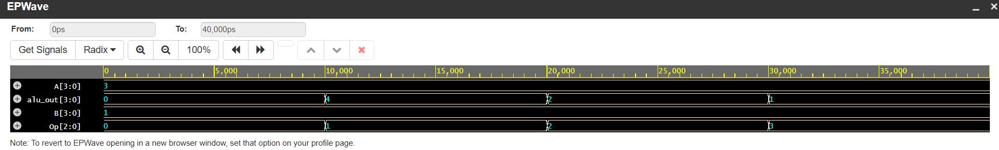

# 4-bit Arithmetic Logic Unit (ALU) Implementation

# Project Overview
This repository contains a **Verilog HDL** implementation of a 4-bit Arithmetic Logic Unit (ALU). The ALU is a digital circuit that performs arithmetic and logical operations and serves as a fundamental building block of a processor's Central Processing Unit (CPU).

This project demonstrates RTL design, behavioral modeling, and functional verification using a directed testbench.

---

# Features & Specifications
- **Data Width:** 4-bit inputs ($A$, $B$) and 4-bit output ($ALU\_Out$).
- **Control Logic:** 3-bit Opcode to select between 8 operations.
- **Flag Logic:** Includes a **Carry-Out** flag to indicate arithmetic overflow.
- **Modeling:** Behavioral Verilog using `always` blocks and `case` statements.

---

# Operations Table
The following operations are supported by this ALU:

| Opcode | Operation | Type | Function |
| :--- | :--- | :--- | :--- |
| `000` | **Addition** | Arithmetic | $A + B$ |
| `001` | **Subtraction** | Arithmetic | $A - B$ |
| 010 | **Logical AND** | Bitwise | A & B |
| `011` | **Logical OR** | Bitwise | $A \text{ \| } B$ |
| `100` | **Logical XOR** | Bitwise | $A \oplus B$ |
| `101` | **Logical NOT** | Bitwise | $\sim A$ |
| `110` | **Left Shift** | Shift | $A \ll 1$ |
| `111` | **Right Shift** | Shift | $A \gg 1$ |

---

# Repository Structure
* **`alu.v`**: The core RTL design source code.
* **`alu_tb.v`**: The testbench used for functional verification.
* **`waveform_alu_result.png`**: Simulation timing diagram showing the design's behavior.

---

# Simulation & Verification
The design was verified by applying various test vectors in a directed testbench environment.

# Tools Used:
- **Simulator:** Icarus Verilog / EDA Playground
- **Waveform Viewer:** GTKWave

# Simulation Results:
Below is the timing diagram illustrating the transition of signals across different opcodes.

  

---

# Future Roadmap
-  Implement a **Zero Flag** to detect null results.
-  Parameterize the design to support **8-bit and 16-bit** operations.
-  Develop a **SystemVerilog** testbench with constrained random stimulus.

---

# Author
**Avoodaiappan** *Electronics and Communication Engineering Student*
